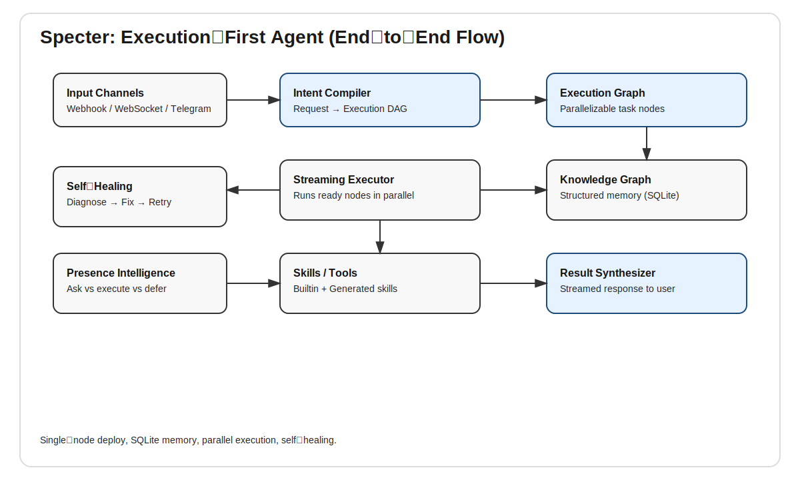

# Specter


Execution-first autonomous agent with parallel DAG execution, self-healing, structured memory, and presence intelligence.

## Status
Early scaffold. Core architecture is in place; functional integrations are being wired in incrementally.

## Architecture


## Features
- Parallel execution graphs (DAG-based)
- Self-healing error handling (strategy-based)
- Structured knowledge graph memory (SQLite)
- Presence intelligence for confirmation vs autonomy
- FastAPI webhooks + WebSocket streaming
- Tool invocation gateway with policy allow/deny
- Local CLI for runs and execution replay

## Quick Start

```bash
poetry install
poetry run uvicorn specter.main:app --reload
```

CLI example:
```bash
specter-cli run "Summarize today’s tasks"
specter-cli tools
specter-cli exec-list
```

Or with Docker:

```bash
docker-compose up --build
```

## Configuration
- `config.yaml` controls execution, LLM routing, and channel settings.
- `.env.example` shows required environment variables.

## Docs
- `docs/architecture.md`
- `docs/api.md`
- `docs/deployment.md`
- `docs/skills.md`
- `docs/roadmap.md`

## Development

```bash
poetry run pytest
poetry run ruff check .
```

## License
MIT
