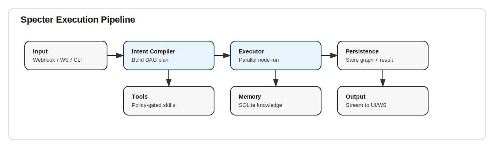

# Specter


Specter is an execution-first autonomous agent that turns intent into parallelized action. It plans tasks as DAGs, executes them, self-heals when possible, and persists knowledge and execution history locally.

## What It Does
- Converts natural language requests into execution graphs
- Runs tasks in parallel where possible
- Persists every execution for replay and auditing
- Stores knowledge locally in SQLite
- Exposes a tool gateway with policy controls

## Architecture



## Product Snapshot


## Why Specter
Specter focuses on minimal, reliable automation rather than heavy frameworks. It is local-first, fast to deploy, and built to provide execution traceability rather than opaque chat logs.

## Quick Start

```bash
poetry install
poetry run uvicorn specter.main:app --reload
```

CLI example:
```bash
specter-cli run "Summarize today’s tasks"
specter-cli tools
specter-cli exec-list
```

## Web UI

```bash
cd web
npm install
cp .env.local.example .env.local
npm run dev
```

Open `http://localhost:3000` to interact with Specter.

Or with Docker:

```bash
docker-compose up --build
```

## API Highlights
- `POST /webhook/{channel}` run a task
- `GET /executions` list executions
- `POST /executions/{id}/replay` replay stored execution
- `POST /tools/invoke` call a tool directly
- `GET /tools` list tools
- `GET /ui` minimal local dashboard

## Configuration
- `config.yaml` controls execution, LLM routing, and channel settings.
- `.env.example` shows required environment variables.

## Docs
- `docs/architecture.md`
- `docs/api.md`
- `docs/deployment.md`
- `docs/skills.md`
- `docs/roadmap.md`

## Development

```bash
poetry run pytest
poetry run ruff check .
```

## License
MIT
