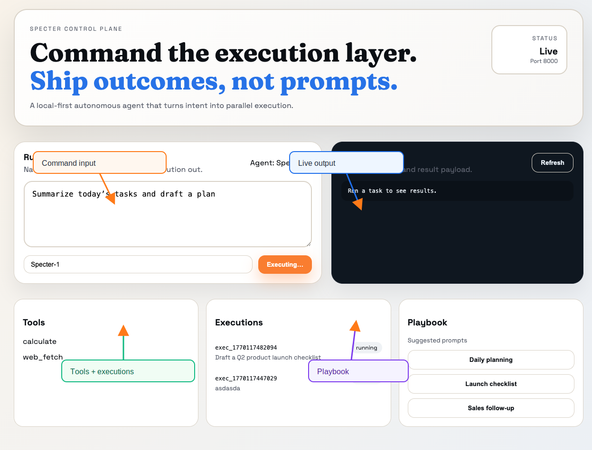

# Specter


Specter is an execution-first autonomous agent that turns intent into parallelized action. It compiles tasks into DAGs, executes in parallel, self-heals where possible, and persists knowledge and execution history locally.

## Product Snapshot


## Why Specter
- Execution graphs instead of linear task chains
- Local-first SQLite persistence with replayable traces
- Deterministic tool gateway with policy controls
- Self-healing for common failures
- Lightweight deployment for laptops, edge boxes, or small VPS

## Core Capabilities
- Intent → execution graph compilation
- Parallel tool execution with traceable events
- Knowledge graph memory (SQLite)
- Skill registry and tool invocation endpoints
- Execution replay and audit trail

## Use Cases
- Launch and project planning runbooks
- Data gathering and synthesis with tools
- Task coordination with deterministic traces
- Lightweight automation without external databases

## Project Tags
- autonomous-agents
- execution-graphs
- knowledge-graph
- local-first
- fastapi
- sqlite

## Architecture


## Quick Start

```bash
poetry install
poetry run uvicorn specter.main:app --reload
```

CLI example:
```bash
specter-cli run "Summarize today’s tasks"
specter-cli tools
specter-cli exec-list
```

## Web UI

```bash
cd web
npm install
cp .env.local.example .env.local
npm run dev
```

Open `http://localhost:3000` to interact with Specter.

Or with Docker:

```bash
docker-compose up --build
```

## API Highlights
- `POST /webhook/{channel}` run a task
- `GET /executions` list executions
- `POST /executions/{id}/replay` replay stored execution
- `POST /tools/invoke` call a tool directly
- `GET /tools` list tools
- `GET /ui` minimal local dashboard

## Configuration
- `config.yaml` controls execution, LLM routing, and channel settings
- `.env.example` shows required environment variables

## Docs
- `docs/architecture.md`
- `docs/api.md`
- `docs/about.md`
- `docs/deployment.md`
- `docs/pr-style.md`
- `docs/skills.md`
- `docs/roadmap.md`
- `docs/contributing-style.md`
- `docs/ci-cd.md`

## Development

```bash
poetry run pytest
poetry run ruff check .
```

## License
MIT

## Community
- `CONTRIBUTING.md`
- `CODE_OF_CONDUCT.md`
- `SECURITY.md`
- `GOVERNANCE.md`
- `MAINTAINERS.md`
- `SUPPORT.md`
- `CITATION.cff`
